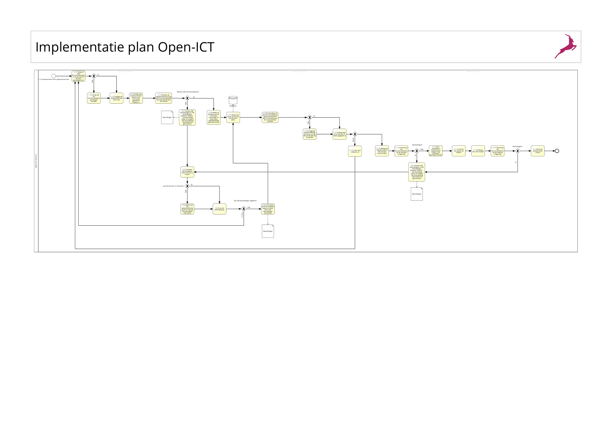

Deliverables
===================================

Hier komen de deliverables te staan.

-------
Implementatie plan
-------

Hier kan je een image vinden voor het implementatie plan:

   
Het stappen plan voor de implementatie is als volgt :
 
Implementatie plan
Alle stappen moeten succesvol uitgevoerd worden. Wanneer dit niet het geval is of wanneer er bevindingen zijn gemaakt, volg dan stappenplan 1.2:
Stappenplan 1.1.0
Stap 1.1.1: Vraag of alle functionaliteiten in de productie branch gemerged is.

Stap 1.1.2: Indien niet alle functionaliteiten toegevoegd zijn, zorg ervoor dat iedereen deze toevoegd.

Stap 1.1.3: Update de desbetreffende branch zodat alle nieuwe functionaliteiten mee genomen zijn.

Stap 1.1.4: Maak een nieuwe release branch aan van de branch ‘Frontend’ genaamd ‘release_X’ met X als de volgende versienr.

Stap 1.1.5: Proefimplementatie
 Checkout de release branch en ga elke functionaliteit (bestaande en nieuwe) bij langs op een lokale omgeving.

Bevindingen gevonden? Volg Stappen plan 1.2 vanaf hier.

Stap 1.1.6: In de code, als er met data gewerkt wordt moet er gecontrolleerd worden of die data ook daa

Bevriezen van de code
Maken van de release notes

Stap 1.1.7: Als de bovenstaande stappen succesvol uitgevoerd zijn. 
backup van huidige productie (zie kopje backup maken)
Kan de live versie ‘offline’ gehaald worden. De standaard ‘Maintenance’ pagina zal zichtbaar gemaakt worden voor de gebruikers. Alleen de admin/beheerder kan nog volledig gebruik maken van de website.

Stap 1.1.8: Vervolgens moet er gecontrolleerd worden of elke functionalitiet gedocumenteerd is en dat dit aan de voorwaarden voldoet. Dit heet: Limited Production Run -> maak hier een haandboekje van op basis van de release notes. Bedenk even welke oude functionaliteiten je wil testen.

Stap 1.1.9 Indien de documentatie niet compleet is, vraag de desbetreffende persoon of hij of zij deze kan bijwerken.

Stap 1.1.10: Bespreek met de product owners of er een Go of NoGo is voor het uitrollen van de nieuwe release.
Stap 1.1.11: Is er een NoGo gegeven? Rollback de voorgaande werkzaamheden en doorloop het implementatie plan opnieuw.

Stap 1.1.12: Merge de release branche naar de ‘dev’ branch.

Stap 1.1.13 Doorloop de website op de online dev omgeving en noteer de bevindingen, indien nodig doorloop ook stap 1.1.6.

Bevindingen gevonden? Volg Stappen plan 1.2 vanaf hier.

Stap 1.1.14: Indien de voorgaande stappen succesvol doorgelopen zijn, kan de standaard ‘maintenance’ pagina zichtbaar gemaakt worden op de live versie.

Stap 1.1.15: Zet de live versie op ‘offline’

Stap 1.1.16: Indien stap 7 succesvol verloopt zonder problemen kan de ‘dev’ branch gemerged worden met de ‘master’ branch. 

Stap 1.1.17: Doorloop de website op de live omgeving en noteer de bevindingen.

Bevindingen gevonden? Volg Stappen plan 1.2 vanaf hier.

Stap 1.1.18: Indien stap 10 succesvol is dan kan de live website weer op ‘online’ gezet worden en mag deze weer volledig gebruikt worden.

Stappenplan 1.2

Stap 1.2.1:
 Noteer de bevindingen in een apart bestand. Hierbij noteer je het volgende:
- De bevinding
- Waar is dit probleem te vinden
- De foutmelding zelf
- Wie heeft deze functionaliteit geschreven

Stap 1.2.2: Probeer eerst zelf 5 tot 10 minuten het probleem op te lossen. 

Stap 1.2.3: Mocht stap 1.2.2 niet lukken meldt dit bij de desbetreffende persoon die het stukje functionaliteit gemaakt heeft en geef aan wat er fout is en vraag of hij of zij dit z.s.m. kan oplossen.

Stap 1.2.4: Los de bevinding op.

Stap 1.2.5: Indien er meerdere bevindingen zijn, moet er gewacht worden tot elk van deze bevinding opgelost zijn voordat Stappenplan 1.1 opnieuw gedaan wordt. 

Als stap 1.2.4 voltooid is kan Stappenplan 1.1 weer doorlopen worden.

Stap 1.2.6: Mocht een bevinding niet snel genoeg opgelost worden voor een oplevering dan zal deze functionaliteit niet aanwezig mogen zijn op de live omgeving. Dit moet ‘uit gecomment’ worden. Noteer dit wel in het bevindingen formulier. Denk hierbij wel aan het noteren van :
- De functionaliteit
- Waar is deze te vinden
- Wat is er gecomment

