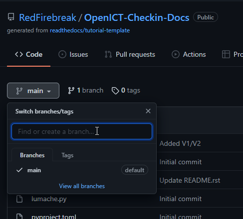
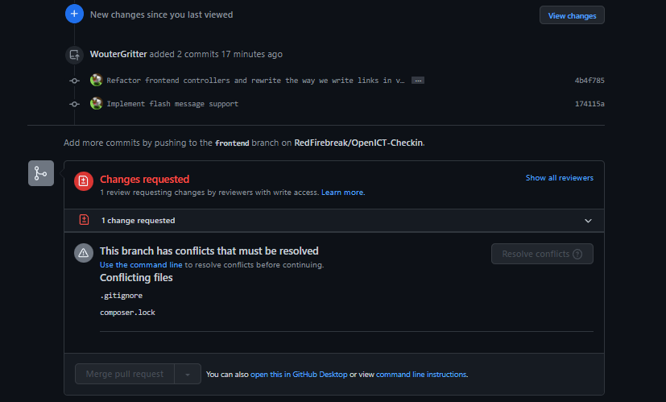

Environment 
===================================

During development, two main sites have been set up to automatically reflect all the changes in the corresponding github branches. These two websites are always in sync with the github repository and will reflect changes within 5 minutes of additions or removals. 

`Main production website <https://www.genericwebsitename.nl/>`_ 
--------
	The latest main branch, this version of the website will only get updated on the release of a new version, often at the end of the sprint period.

`Main development website <https://dev.genericwebsitename.nl/>`_
--------
	The latest version of the development branch. This version continuesly updates with every addition to the development branch. This website has been set up to spot any extra deployment issues that may arise while updating the main website.
	
Repository (Github) flow
--------
The `Github repository <https://github.com/RedFirebreak/OpenICT-Checkin-Docs>`_ has protected branches. This means that direct commiting/pushing to the master and dev branch is not allowed by default. Instead, the user/programmer is encouraged to create a new branch from the development branch. There are many tutorials to do so, or you can simply ask your team to assist you.

When a new branch is created, a copy is made of the current state of the project. Further on, you can easily work on your changes without interruptions from other commits or pushed. This decreases the amount of merge conflicts.

When the user/programmer is done with their part of code and want to upload it to the development (or even master) branch. They should commit and push their changes to their own made branch. When their branch has the changes included, the user/programmer can create a pull request to merge their state of the project, with the development or master version of the project.

To approve and merge the pull request, another member of the team is required to review the code and approve the changes. This is to prevent "bad" code to enter the project and to make sure multiple team members are aware of the changes. A pull request to the master branch requires two reviews. 

.. image:: images/mergedpullrequest.png.png
   :align: center

Documentation
--------
The documentation of this project will be in continued development and is subject to (many) changes.

.. autosummary::
   :toctree: generated
