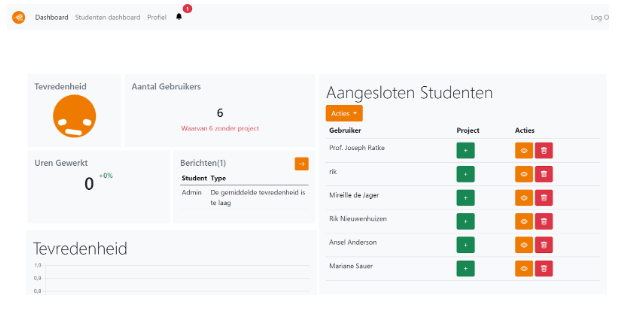

Functionaliteiten
============================

De volgende link redirect naar de aanwezige documentatie over de functionaliteiten van de website / applicatie:
  - https://docs.google.com/document/d/1_zgtPjhC6f7ch_OGNXdO3XTsh9qHOM5TyB4ze2sh29A/edit?usp=sharing
  
.. note::
  De volgende documentatie is puur geschreven vanwege administratieve redenen. Hierin wordt globaal uitgelegd wat, wat doet en hoe het in elkaar steekt.
  
 
--------------  
  Laravel
--------------
Het Laravel gedeelte is opgezet in vijf delen:
  - Database (MariaDB)
  - models
  - Api
  - controller
  - pagina

Elke laag communiceert alleen met onderdelen op dezelfde laag of maximaal 1 laag erboven. Het enige wat er met de laag beneden wordt gedaan is het feliciteren van data aan die laag.

Pagina
--------------
Dit is de pagina, Hier wordt de HTML van de pagina gegenereerd. Hier staan ook de loops om bijv. tabellen van users weer te geven.
OpenICT-Checkin/resources/views/pages

Controller
--------------
Hier wordt de data via de api’s opgehaald en verwerkt om de data vervolgens aan de pagina’s te geven. De manier waarop pagina’s aan controllers wordt gekoppeld gebeurt in de file web.php
  OpenICT-Checkin/app/Http/Controllers/Frontend/
  
API
-------------
In de Applicatie worden alle getters en setters van informatie op de database op de api laag gedaan. De api laag roept de models aan via Eloquent ORM om query's te doen op de database.
	
.. note::
Op dit moment zijn alle getters en setters op één api file: OpenICT-Checkin/routes/apiv1.php

Model
-------------
Eloquent ORM is een gedeelte query builder dat gebruikt kan worden op de models zodat er op een makkelijke manier query's gemaakt kan worden zonder dat er veel SQL-code geschreven hoeft te worden, afbeelding 2. De mogelijkheid is er om pure SQL-code te gebruiken samen met models, afbeelding 3.
OpenICT-Checkin/app/Models/

Afbeelding 2

Afbeelding 3

Database
-------------
De database is een MariaDB database. Laravel forceert om tabellen te gebruiken die eindigen op s, om zo de tabellen in meervoud te hebben. De database heeft kort voor oplevering een update gehad. Er wordt geen gebruik gemaakt van views of procedures. 

De database wordt opgebouwd en gevuld door seeders en migrations. Migrations maken de tabellen en kolommen en seeders stoppen data in de database.

Notifications
-------------
Wanneer sommige criteria aanwezig zijn al er een notificatie in deze tabel komen. Op dit moment wordt het gebruikt om de docent te notificeren als de gemiddelde blijheid, van gekoppelde studenten, onder een bepaald niveau komt. De connectie naar Users is ervoor om te kunnen zeggen dat het om een bepaalde user gaat.

Form
-------------
De form wordt gebruikt om verschillende vragen te groeperen. De vragen worden opgeslagen in de tabel questions. De koppeltabel naar Users is een futureproof om zo de mogelijkheid te geven om studenten aan verschillende formulieren te koppelen. Omdat er de mogelijkheid is om deze tool te gebruiken op meerdere opleidingen die andere dagelijkse check-ins kunnen hebben.

Een form kan dus meerdere vragen bevatten en kan aan meerdere users gekoppeld zijn.

Answersheets
-------------
De tabel om antwoorden te groeperen en te koppelen aan een formulier. In de tabel answers komt ook de vraag te staan hoe de vraag op het moment van schrijven staat. Om zo de mogelijkheid te bieden om vragen aan te passen, maar om zo ook de vraag te hebben waar de student op heeft beantwoord. 

Security Profile
-------------
In deze tabel komen de default toegangsrechten per account soort. Als er een nieuwe recht gemaakt moet worden, bijv. een nieuwe vragen formulier aanmaken, dan is het de bedoeling dat het een nieuwe kolom in de tabel komt. In de users komen dezelfde kolommen om persoonlijke rechten mogelijk te maken.

Projects
-------------
Hier komen projecten in te staan waar users aan vast gemaakt kunnen worden. Er is een tussen tabel omdat sommige users aan meerdere projecten kunnen werken.
Connected Users
In deze tabel worden de docent/student relaties opgeslagen.

Jobroles
-------------
In deze tabel worden de jobroles opgeslagen die de student kan kiezen om als doel te hebben. De tussentabel met levels is er omdat de jobroles bepaalde niveaus hebben van competenties.

Comptencies, Levels, Architectures en Activities
-------------
Deze tabellen samen vormen de HBO-I competenties. De users kunnen een bepaald niveau van competenties selecteren om als doel te hebben of om de niveaus van die user op te slaan. https://hbo-i.nl/domeinbeschrijving/

Submissions
-------------
Hier worden de beroepsproducten opgeslagen. Bij elk product moet staan bij welk competentie het hoort.

Competency Meeting
-------------
Hier worden de weekelijkse gesprekken die over de hbo-i competenties gaan opgeslagen. In de tabel wordt ook het weeknummer opgeslagen met connectie naar competenties en criterias

Criteria
-------------
Hier worden de criteria, die in de wekelijkse gesprekken staan, opgeslagen

Aanbevelingen
-------------

Schermuitleg
=============

Inlogscherm
-------------
Dit scherm wordt gebruikt om in te loggen, tevens is het vanuit dit scherm mogelijk om naar het wachtwoord vergeten scherm te gaan. In dit scherm worden de inloggegevens ingevuld om doorgewezen te worden naar het dashboard.

Bestanden
-------------
De bestanden die horen bij dit scherm, en dus de functionaliteit beschreven hebben zijn:

  - AuthenticatedSessionController.php
  - login.blade.php

.. note::
Binnen het project zijn er geen belangrijke aanpassingen gedaan naast het aanpassen van het design. Design is terug te vinden in login.blade.php en is geschreven in bootstrap 5. Voor uitleg van bootstrap refereer ik naar de documentatie.

Dashboard(docent)
-------------
Het dashboard van de docent heeft als doel gemakkelijk een inkijk te geven in de status van de studenten. Het is op het dashboard mogelijk om de gemiddelde tevredenheid van de gebruikers te zien, het aantal gebruikers dat er zijn (met een opmerking met hoeveel studenten nog een project zoeken), er kan gezien worden hoeveel uren de studenten hebben gewerkt vandaag aan de projecten (met een percentueel verschil erbij met de dag van gister), het bovenste bericht kan worden bekeken, de tevredenheid van de studenten per student in grafiekvorm (filterbaar) en tot slot kunnen de aangesloten(docenten kunnen studenten selecteren die zij kiezen te volgen te begeleiden. 

Bestanden
-------------
De functionaliteiten en variabelen die nodig zijn om dit dashboard tot stand te laten komen zijn terug te vinden in de DocentenDashboardController.php. Binnen de controller zijn een aantal functies beschreven. Het php-bestand is voorzien van documentatie voor een nadere verklaring van wat de functies precies doen. 

  Het design van het dashboard het dashboard en de functionaliteiten die het dashboard heeft zijn te vinden in het mapje ‘views->pages->docentdashboard’. De volgende views zijn hier terug te vinden:

De functionaliteiten die gekoppeld zijn aan de views zijn terug te vinden in de controller zoals bovenstaand staat beschreven.

Dashboard (Studentendashboard)
--------------
Het dashboard wordt gebruikt om studenten een snel overzicht te geven van de tevredenheid over een periode van de afgelopen week. Daarnaast geeft dit dashboard weer op welke dagen hoeveel uur gewerkt is aan een project. Tot slot is het mogelijk om vanuit dit dashboard je antwoorden te bekijken, bewerken en verwijderen. 

Bestanden
-------------
De functionaliteiten en variabelen die nodig zijn om dit dashboard tot stand te laten komen zijn terug te vinden in de DashboardController.php. Binnen de controller zijn een aantal functies beschreven. Het php-bestand is voorzien van documentatie voor een nadere verklaring van wat de functies precies doen. 

Het design van het dashboard het dashboard en de functionaliteiten die het dashboard heeft zijn te vinden in het mapje ‘views->pages->dashboard’. De volgende views zijn hier terug te vinden:

Profiel
------------
De profiel pagina geeft een overzicht van de gegevens van een gebruiker. Belangrijke gegevens hier zijn de projecten, de competenties en niveau’s en tot slot de beroepsrollen. Ook is het mogelijk om hier gegevens aan te passen.

Bestanden
------------
De functionaliteiten en variabelen die nodig zijn om dit dashboard tot stand te laten komen zijn terug te vinden in de ProfileController.php. Binnen de controller zijn een aantal functies beschreven. Het php-bestand is voorzien van documentatie voor een nadere verklaring van wat de functies precies doen. 

Het design van het dashboard het dashboard en de functionaliteiten die het dashboard heeft zijn te vinden in het mapje ‘views->pages->profile’. De volgende views zijn hier terug te vinden de uitleg van de functionaliteiten zijn terug te vinden in de controller.

