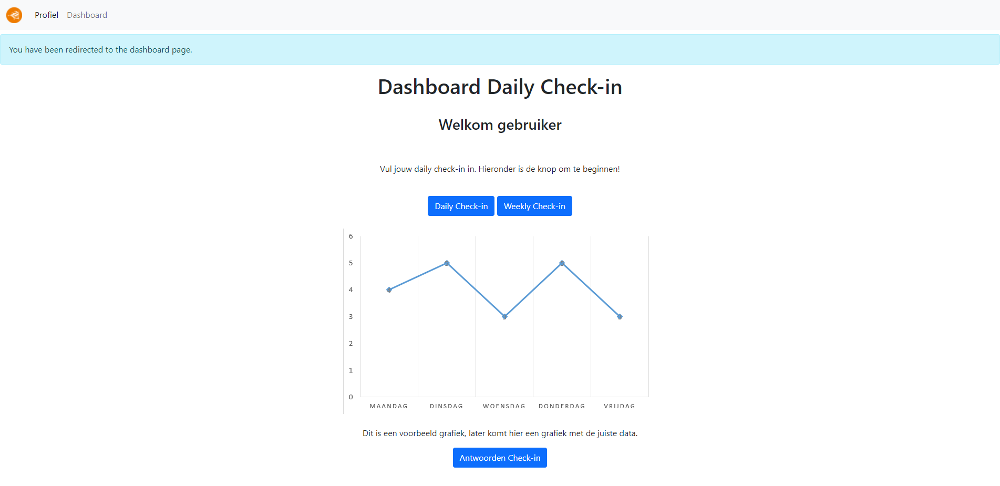

Installation
===================================
.. _requirements:

Requirements
------------

- `GIT available from commandline <https://git-scm.com/>`_
- `XAMPP with PHP 8.0 or higher <https://www.apachefriends.org/index.html>`_
- `Composer <https://getcomposer.org/>`_
- - Syntax error while installing? Go to the specified file and place the path within "" marks.
- PHP installed in PATH variables (Available as a checkmark in the composer installer)
- Access to `the restricted github page <https://github.com/RedFirebreak/OpenICT-Checkin>`_ (Ask RedFirebreak or any collaborator for access)

After making sure that all the requirements are met on your system, you can continue to the next section.

.. _installation:

Installation
------------
.. note::

   This is only required if you want to `develop` for the project, want to see or use the project? Go to the `development website`_ or the `production website`_. Further, this installation sets up a XAMPP server on your local machine to start developing.

Start your XAMPP control panel, then start apache and MySQL. After that, to test and develop this project locally, clone the base code from the main repository:

.. code-block:: console

   (cmd) $ cd {path/to/xamp/htdocs}
   (cmd) $ git clone https://github.com/RedFirebreak/OpenICT-Checkin.git

Now, preferring on your installation choice, move the insides of the now downloaded folder to your preferred web-space. You do not have to keep the path specified in this tutorial, as long as you know where you store the pulled github files

In the project folder, copy the ``.env.example`` to a new file called ``.env`` and fill in the config file. By default, you can use `root` as the database password with an empty password.

.. note::

   Make sure to prepare the required database in advance. If no database is present, the application will **NOT** load and you will see a `500: error` message.

After cloning, go into path of the cloned folder and keep the terminal open

.. code-block:: console

   (cmd) $ cd {path/to/xamp/htdocs/project}
   (project/) $ 

And switch to the dev branch for your developing

.. code-block:: console

   (project/) $ git checkout dev

With the still opened terminal, peform the following commands:

.. code-block:: console

   (project/) $ composer install
   (project/) $ composer update

   (project/) $ php artisan key:generate

This will install all the required filed, make sure they are updated and set them up for auto-loading. After this, you will generate your own security key for the application.

Technically, you should now see the project as below! `You can also click this link to go to the localhost page. <http://localhost/OpenICT-Checkin/public/>`_

.. note::

   Error 500 page instead of the project? Or a different error? Make sure to restart the apache server and run `composer update` again to make sure the application can gather all the packages. Otherwise, google the error given for a quick fix, or call for your team! :)

.. _updating:
Updating
------------
To update the application, move a cmd to the git cloned project directory and peform the following commands:

.. code-block:: console

   (cmd) $ cd {path/to/xamp/htdocs/project}
   (project/) $ 

Then, with the same cmd screen open:

.. code-block:: console

   (project/) $ git pull
   (project/) $ composer update

The application is now up to date with the dev branch as you should see on the `development website`_

Usage
----------------

**INCOMPLETE**

Contents
--------

.. toctree::

   requirements
   installation
   updating
   usage

.. _development website: https://dev.genericwebsitename.nl/
.. _production website: https://www.genericwebsitename.nl/
