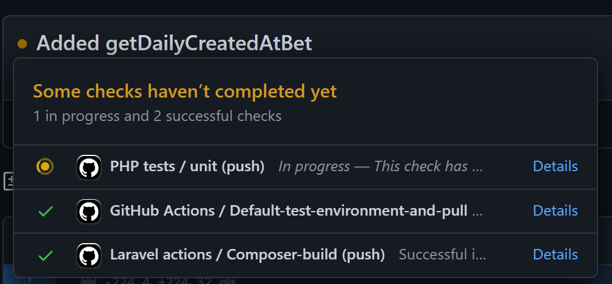
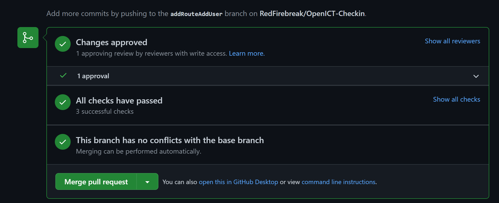
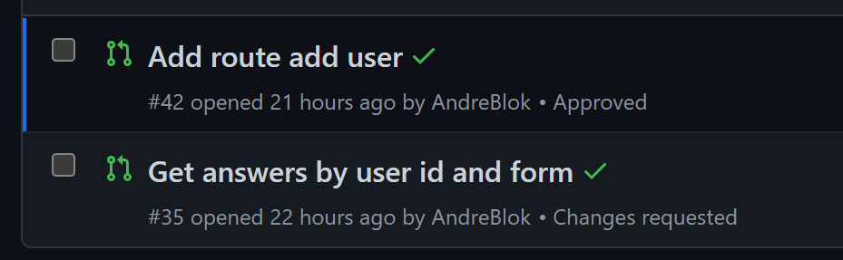
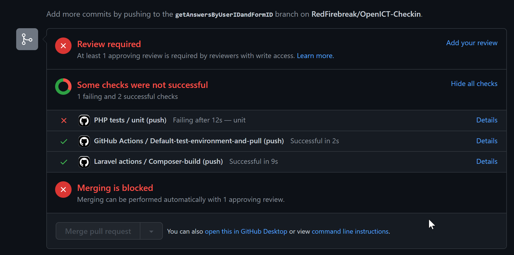

Tests 
===================================
.. tests:

To ensure the application works, the team had written many checks that will automatically be tested during github merges, pulls and transfers. For an accrate view of the current tests, one should go to the "tests" folder in the github page.

Also, pulling up a random commit should show the tests being run and (hopefully) succesfully being completed.

.. _running:
Running tests
--------
This is how the tests look when they are being run:

.. _passed:
Passed tests
--------
This is how the tests look when they have been succesfully completed:

.. _failed:
Failed tests
--------
This is how the tests look when they have been succesfully completed:

